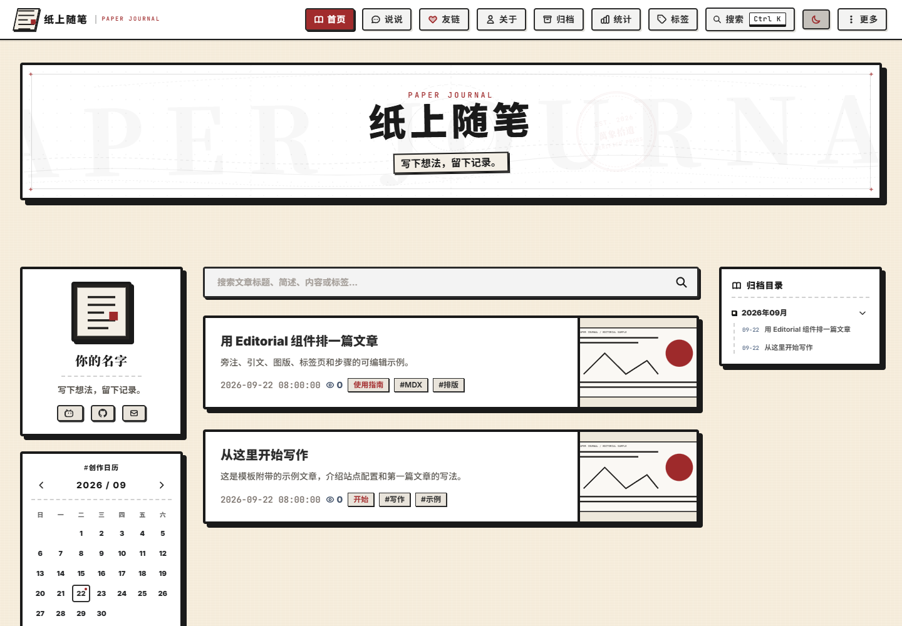

# Wanxiang Shiyilu · Astro Blog Template

[简体中文](README.md) · [Deployment guide](docs/deployment.md) · [Component examples](src/content/posts/2026-09-22-editorial-components.mdx) · [Issues](https://github.com/Gnix807/wanxiang-shiyilu-template/issues)

An Astro blog template for technical articles, essays and everyday notes. The reading interface combines paper-inspired surfaces, serif typography and vermilion accents. Content is written in Markdown / MDX and can be deployed to Cloudflare Pages or other static hosting platforms.

This project is derived from [ImUpXuu/xuhome](https://github.com/ImUpXuu/xuhome) and adapted from the Wanxiang Shiyilu personal blog into a reusable template.



[View the mobile preview](docs/images/preview-mobile.png)

## Features

- **Content management:** Markdown / MDX articles, short posts, categories, tags and archives.
- **Editorial typography:** Components for quotations, sidenotes, figures, tabs, steps, notebooks and seals.
- **Reading tools:** Site search, theme switching and an image lightbox.
- **Subscriptions:** RSS / Atom feeds.
- **Local fonts:** Bundled Inter, Noto Serif SC, Noto Sans SC and JetBrains Mono, with license files.
- **Static deployment:** Cloudflare Pages configuration and GitHub Actions build checks.

The template uses Astro, TypeScript, React, Svelte and Tailwind CSS. It includes two example articles, one short post and SVG placeholder artwork. Comments, analytics, weather and personal profile requests are disabled by default.

## Quick start

### Requirements

Use **Node.js 24** and **pnpm 11.2.2** to match the CI environment. Dependency versions are pinned in `pnpm-lock.yaml`.

### Create a site

1. Select **Use this template** on GitHub to create your own repository.
2. Clone the new repository and open its root directory.
3. Install dependencies and start the development server:

```sh
pnpm install --frozen-lockfile
pnpm dev
```

Open the development URL printed in the terminal. After configuring the site and replacing the example content, build and preview it:

```sh
pnpm build
pnpm preview
```

Build output is written to `dist/`. The `private: true` field in `package.json` prevents npm publication; it does not affect GitHub's template feature.

### Commands

| Command | Description |
| --- | --- |
| `pnpm dev` | Start the development server |
| `pnpm build` | Check MDX style conversion and font assets, generate the commit index and build the site |
| `pnpm preview` | Preview the generated static site |
| `pnpm lint` | Run TypeScript type checking |
| `pnpm check:assets` | Check bundled font files and license files |
| `pnpm check:mdx` | Check the MDX inline-style conversion dependency |
| `pnpm commit-index` | Update the article commit history index |

## Project structure

```text
src/
├── components/       # Page and interactive components
│   └── editorial/    # Editorial typography components
├── config/           # Site, author, about page and friend links
├── content/
│   ├── posts/        # Markdown / MDX articles
│   └── talks/        # Short posts
├── data/             # Structured page data
├── layouts/          # Page layouts
├── pages/            # Routes and feeds
├── plugins/          # Markdown / MDX processing plugins
└── styles/           # Global styles and font definitions
public/               # Static images, fonts and other assets
scripts/              # Build checks and data generation
docs/                 # Deployment and validation documentation
```

## Configuration

Replace the following example settings and assets before publishing:

| Location | Purpose |
| --- | --- |
| [`src/config/site.ts`](src/config/site.ts) | Site name, author profile, navigation, social links, content license and optional services |
| [`src/config/about.md`](src/config/about.md) | About page content |
| [`src/config/friends.json`](src/config/friends.json) | Friend links; empty by default |
| [`public/avatar.svg`](public/avatar.svg) | Site and author avatar |
| `src/content/posts/`, `src/content/talks/` | Example articles and short posts |
| [`public/robots.txt`](public/robots.txt) | Crawler rules; use the actual domain if adding a Sitemap directive |
| [`src/pages/privacy.astro`](src/pages/privacy.astro) | Privacy notice for the services you enable |

Create a local `.env` using [`.env.example`](.env.example) as a reference, and set production environment variables through your hosting platform. Before deployment, set `PUBLIC_SITE_URL` to the site's full HTTPS URL without a trailing slash. Replace the placeholder name, email and `example.com` values in the configuration.

Do not prefix sensitive variables with `PUBLIC_`. Configure optional services such as comments and analytics in `src/config/site.ts`, and update the privacy notice when enabling them.

## Writing content

### Articles and metadata

Place articles in `src/content/posts/` using `.md` or `.mdx`. The recommended naming convention is `YYYY-MM-DD-slug.mdx`. Start each file with Frontmatter:

```yaml
---
title: My first article
description: A short article summary.
date: '2026-09-22'
tags: [Notes]
category: Life
preserveHeadingLevels: true
---
```

The page layout renders the article title. Start body headings at H2 (`##`), followed by H3 and H4 as needed. `preserveHeadingLevels: true` preserves the source heading levels; legacy articles without this setting retain the compatibility behavior that shifts headings down one level. Chinese prose uses 「」 and 『』 for quotations.

### Editorial components

Import components after the Frontmatter in an MDX file:

```mdx
import { PullQuote, Sidenote, Plate } from '../../components/editorial';

<PullQuote source="Example">

Leave room for the words, and time for the reader.

</PullQuote>
```

See the [Editorial example article](src/content/posts/2026-09-22-editorial-components.mdx) and [component directory](src/components/editorial) for usage. Both standard Markdown images and `Plate` figures support the image lightbox.

Short posts belong in `src/content/talks/` and use Markdown with Frontmatter. See the [example short post](src/content/talks/2026-09-22-hello.md).

## Deploying to Cloudflare Pages

Connect your GitHub repository to Cloudflare Pages with the following settings:

| Setting | Value |
| --- | --- |
| Production branch | `main` |
| Framework preset | Astro |
| Build command | `pnpm build` |
| Output directory | `dist` |
| Node.js | `24` |
| pnpm | `11.2.2` |
| `PUBLIC_SITE_URL` | The site's public URL |

[`wrangler.toml`](wrangler.toml) defines the static output directory; update its project name before use. GitHub Actions checks the build and uploads the static output. The connected Pages project handles automatic deployment.

See the [deployment guide](docs/deployment.md) for full instructions and optional build variables.

## Maintenance and contributions

Use [Issues](https://github.com/Gnix807/wanxiang-shiyilu-template/issues) to report bugs or suggest improvements. Include reproduction steps, environment details and relevant logs when reporting a problem.

This repository also accepts [friend-link requests for Wanxiang Shiyilu](https://github.com/Gnix807/wanxiang-shiyilu-template/issues/new?template=friend-request.yml). When creating your own site from this template, update the site details in `.github/ISSUE_TEMPLATE/friend-request.yml` and the application link on the friends page.

Run `pnpm lint` and `pnpm build` before submitting code changes in a pull request. Include desktop and mobile screenshots for changes to the interface or article typography. The [validation record](docs/validation.md) documents the existing checks.

Keep `src/data/commit-index.json` in version control: pages depend on this data, and the build updates it from the current repository. Supplementing commit history through the GitHub API is disabled by default.

After withdrawing an article locally, build into a new output directory or manually remove its old output to avoid stale preview pages. CI and Pages use clean checkouts.

## Attribution and acknowledgements

[ImUpXuu/xuhome](https://github.com/ImUpXuu/xuhome) is the upstream codebase and primary design reference for this project. Thanks to [ImUpXuu](https://github.com/ImUpXuu) and the upstream contributors for their open-source work.

This project builds on that foundation with revised visual styling and article typography, Editorial MDX components, example content and Cloudflare Pages configuration. Original attribution and third-party license notices are retained.

## License

Application code is licensed under the [MIT License](LICENSE). Some files and assets carry separate licenses: `src/types.ts` retains its Apache-2.0 notice, and bundled fonts use the SIL Open Font License. See [NOTICE.md](NOTICE.md) for details.

The included example articles, short post, about page and original SVG artwork are provided under MIT. Users determine the licenses for content they add. See the [content license](CONTENT_LICENSE.md).
